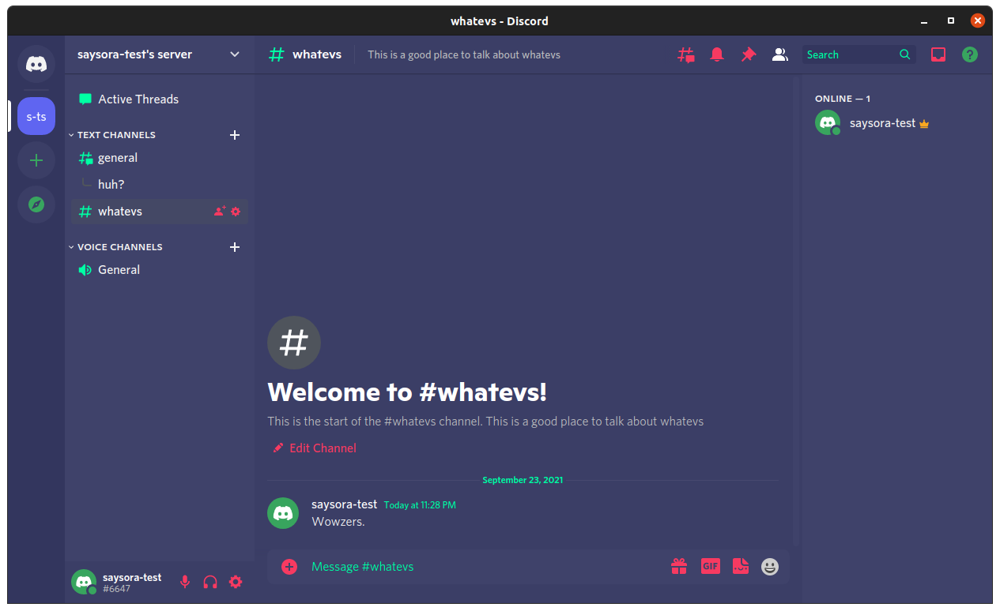

# Color Discord

A Custom plugin used to allow users to select their own color schemes for Discord

## How to use

After installing (see below), restart discord, then once it's loaded hit `ctrl + .` to pull up the editor window. The fields can handle rgb(), rgba(), and hex values.

## Installation

Download the latest zip from the releases and follow the instructions below based upon your OS.

#### Linux

Unzip the ColorDiscord folder and rename it to app then place it in /usr/share/discord/resources

Folder structure should look like

`/usr/share/discord/resources/app/preload.js`
`/usr/share/discord/resources/app/index.js`
`/usr/share/discord/resources/app/ColorDiscord.js`
`/usr/share/discord/resources/app/package.json`

#### Windows

Unzip the ColorDiscord folder and rename it to app then place it in C:\Users\%username%\AppData\Local\Discord\resources

Folder structure should look like

`C:\Users\%username%\AppData\Local\Discord\resources\app\preload.js`
`C:\Users\%username%\AppData\Local\Discord\resources\app\index.js`
`C:\Users\%username%\AppData\Local\Discord\resources\app\ColorDiscord.js`
`C:\Users\%username%\AppData\Local\Discord\resources\app\package.json`

#### Mac Instructions TBD

#### More Questions?

I have a server on discord for a theme where you can ask about this one.

## Credits

Thank you PowerCord for the easy injector. It made setting up this lightweight plugin so much more simple.
